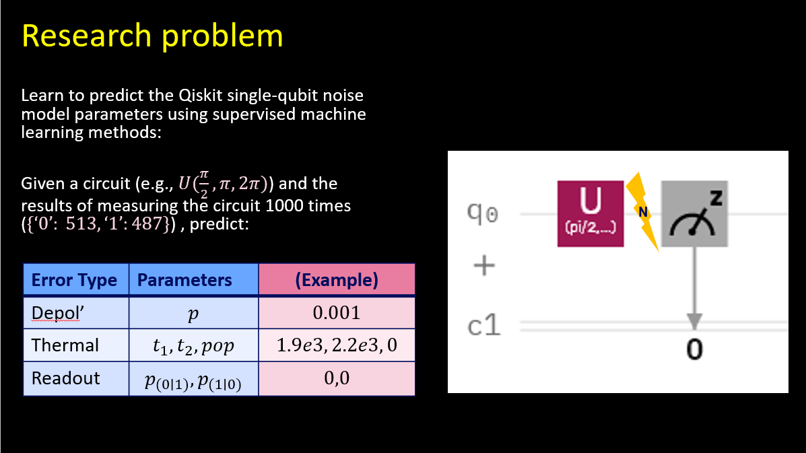

# IBM Ascola Challenge

This research project was pursued during the [IBM](https://www.research.ibm.com/labs/haifa/) - [Ascola](https://www.madaney.net/en/site/programs/ascola/)
Challenge, August-December 2020.

## The Challenge

Although intermediate-scale quantum computers are available for use today, they suffer from quantum noise.

In order to combat this noise, our team aimed to predict the noise model applied to a quantum circuit
using machine learning techniques.

## Attempt at Solution

### 1) Problem Statement
We approached this problem as an open-ended question. Thus, a lot of time was devoted to
translating the problem into concrete terms.

### 2) Dataset Generation
Using Qiskit Simulators, we produced synthetic datasets which span the defined state-space uniformly.

The datasets can be found in the [`datasets`](datasets) folder. Due to size limitations, the largest dataset can be found [here](https://drive.google.com/drive/folders/1AyGy_VYOjpMLE_dmz-4ZQ1NY-A5inEca).

### 3) Dataset Exploration
Finally, we explored the synthetic datasets produced using [Jupyter Notebooks](notebooks).

<!-- CONTACT -->
## Contact

Noam Siegel - noamsi@post.bgu.ac.il

Raphaelbuzaglo - raphaelbuzaglo@gmail.com

Shelly Garion - shelly@il.ibm.com

Gadi Aleksandrowicz - gadial@gmail.com

Project Link: [https://github.com/noamsgl/IBMAscolaChallenge](https://github.com/noamsgl/IBMAscolaChallenge)

## Acknowledgments
* [IBM Haifa](https://www.research.ibm.com/labs/haifa/)
* [Ascola](https://www.madaney.net/en/site/programs/ascola/) 
* [Qiskit](https://qiskit.org/)
  

